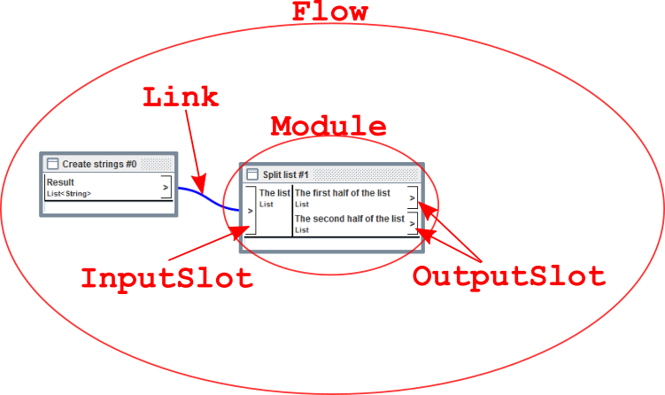

# flow-core

The core interfaces and classes of the Flow library.

The basic structure of a `Flow` is shown in this image:

(Note: The `flow-core` library does not handle any visual representation 
of flows. The image was created from a screenshot of the `flow-gui` project)

The most important elements are summarized here.

## `Flow`

The [`Flow`](https://github.com/javagl/Flow/blob/master/flow-core/src/main/java/de/javagl/flow/Flow.java)
is the main interface in this package, and describes the processing flow. 
In order to create a `Flow` instance (specifically, a `MutableFlow`
instance) to which modules and links can be added, the factory methods
in the `Flows` class can be used:

    MutableFlow flow = Flows.create();

## `Module`

A `Flow` contains 
[`Module`](https://github.com/javagl/Flow/blob/master/flow-core/src/main/java/de/javagl/flow/module/Module.java) objects. 
These are the basic building blocks for the flow-based programming. In order 
to create a `Module` instance that can be added to a `Flow`, there are 
several options:

- Implement the `Module` interface from scratch (not recommended), and create 
  an instance of this implementing class
- Extend one of the abstract base classes, like `SimpleAbstractModule`,
  and create and instance of the implementing class
- Use one of the factory methods from the `Modules` class

Details about creating custom modules are explained in the section about
*Implementing custom modules* (**TODO**: Link).

The factory methods in the `Modules` class mainly aim at the creation of 
modules that wrap a `Supplier`, `Consumer` or `Function` instance, 
or for the creation of modules that call methods or constructors via 
reflection:

- `Modules#createForSupplier`
- `Modules#createForConsumer`
- `Modules#createForFunction`
- `Modules#createForMethod`
- `Modules#createForConstructor`

Examples for creating `Module` instances may thus be

    Module moduleA = new MyClassImplementingTheModuleInterface();
    Module moduleB = Modules.createForConsumer(
        moduleInfo, System.out::println);

# `Slot` (`InputSlot` and `OutputSlot`)

Each `Module` may have multiple
[`Slot`](https://github.com/javagl/Flow/blob/master/flow-core/src/main/java/de/javagl/flow/module/slot/Slot.java)
objects. Particularly, an 
[`InputSlot`](https://github.com/javagl/Flow/blob/master/flow-core/src/main/java/de/javagl/flow/module/slot/InputSlot.java)
is a source of the data that is processed in the module, and an 
[`OutputSlot`](https://github.com/javagl/Flow/blob/master/flow-core/src/main/java/de/javagl/flow/module/slot/OutputSlot.java)
is where the module provides the results of its computations.

## `Link`

A
[`Link`](https://github.com/javagl/Flow/blob/master/flow-core/src/main/java/de/javagl/flow/link/Link.java)
connects the `OutputSlot` of one module with the `InputSlot` of another. 
Multiple links may be attached to one  output slot, but only one link may be 
attached to an input slot.

In order to create a `Link` instance that connects two modules, the
factory methods in the `Links` class may be used:

    Link link = Links.create(
        sourceModule, sourceSlotIndex, 
        targetModule, targetSlotIndex);

## Executing a `Flow`

A `Flow` may be executed with a 
[`FlowExecutor`](https://github.com/javagl/Flow/blob/master/flow-core/src/main/java/de/javagl/flow/execution/FlowExecutor.java):

    FlowExecutor flowExecutor = FlowExecutors.create();
    flowExecutor.execute(flow);
    
**Important note**: There may be many different execution strategies for 
a `Flow`. The current (default) implementation of a `FlowExecutor` 
simply executes the flow using "wavefronts": In each step, it executes
all modules whose predecessors already have been executed. But this
is an implementation detail. Future extensions and other flow execution
strategies may make it necessary to extend the `FlowExecutor` interface
or even the other core classes.
     

## The `ModuleInfo` and `SlotInfo` interfaces

Each `Module` has an associated 
[`ModuleInfo`](https://github.com/javagl/Flow/blob/master/flow-core/src/main/java/de/javagl/flow/module/ModuleInfo.java)
object, which in turn contains [`SlotInfo`](https://github.com/javagl/Flow/blob/master/flow-core/src/main/java/de/javagl/flow/module/slot/SlotInfo.java)
objects. Together, these summarize the unmodifiable information about the
structure of the module and its slots. Each `ModuleInfo` and `SlotInfo` 
contains a *name* and a *description*. The `SlotInfo` objects additionally 
contain information about the *types* of the values that are expected for 
or provided by the respective slot. In terms of a programming language,
the `ModuleInfo` corresponds to the "method signature", with additional
metadata.

Predefined types of `ModuleInfo` instances can be created with the 
`ModuleInfos` class. The available methods here correspond to the
ones for creating `Module` instances in the `Modules` class:

- `ModuleInfos#createForSupplier`
- `ModuleInfos#createForConsumer`
- `ModuleInfos#createForFunction`
- `ModuleInfos#createForMethod`
- `ModuleInfos#createForConstructor`

Alternatively, the `Modules#create` method returns a `ModuleInfoBuilder` 
that can be used to create `ModuleInfo` instances fluently:

    ModuleInfo moduleInfo = ModuleInfos.create("Split list", "A module that splits a list in two parts")
        .addInput(List.class, "Input list", "The list that will be split")
        .addOutput(List.class, "First half", The first half of the input list")
        .addOutput(List.class, "Second half", "The second half of the input list")
        .build();

More information about the role of the `ModuleInfo` is explained in the 
section about *Implementing custom modules* (**TODO**: Link).

            